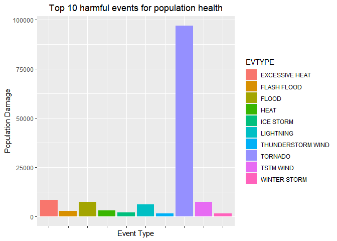

# Synopsis  

This project involves exploring the U.S. National Oceanic and Atmospheric Administration's (NOAA) storm database. This database tracks characteristics of major storms and weather events in the United States, including when and where they occur, as well as estimates of any fatalities, injuries, and property damage.
In the findings, it is found that "Tornado" is the greatest consequence for both population health and economic loss.  

# Data Processing  


```r
if(!dir.exists("./data")){
  dir.create("./data") # creating a directory for storing data.
}

setwd("./data") # setting the working directory for created directory.

download.file("https://d396qusza40orc.cloudfront.net/repdata%2Fdata%2FStormData.csv.bz2", "noaa.csv.bz2") # downloading.....data
noaa <- read.csv("noaa.csv.bz2")
```

# Analyzing the effect of most harmful events on human health


```r
library(tidyverse)
library(ggplot2)
x <- data.frame(noaa %>% group_by(EVTYPE) %>% summarise(population_damage = sum(FATALITIES, INJURIES))) # adding fatalities and damage
                                                                                                        # for total population damage.

print(paste("The total number of missing values in x is ", sum(is.na(x)), sep = " "))
```

```
## [1] "The total number of missing values in x is  0"
```

```r
arranged_x <- x %>% arrange(desc(population_damage)) # decreasing order of damages due to different events. 
top_10 <- arranged_x[1:10, ] # top 10 most harmful events on human health.

g <- ggplot(top_10, aes(EVTYPE, population_damage))
g <- g + geom_bar(aes(fill = EVTYPE), stat = "identity") + 
  labs(x = "Event Type") + labs(y = "Population Damage") + 
  labs(title = "Top 10 harmful events for population health") + 
  theme(axis.text.x = element_blank(), plot.title = element_text(hjust = 0.5))
print(g)
```

<!-- -->

# Analyzing the effect of most harmful events on economy


```r
y <- data.frame(noaa %>% group_by(EVTYPE) %>% summarise(economic_loss = sum(PROPDMG, CROPDMG))) # adding PROPDMG and CROPDMG
                                                                                                # for total economic loss.

print(paste("The total number of missing values in y is ", sum(is.na(y)), sep = " "))
```

```
## [1] "The total number of missing values in y is  0"
```

```r
arranged_y <- y %>% arrange(desc(economic_loss)) # decreasing order of damages due to different events. 
top_10 <- arranged_y[1:10, ]  # top 10 most harmful events on economy.

g <- ggplot(top_10, aes(EVTYPE, economic_loss))
g <- g + geom_bar(aes(fill = EVTYPE), stat = "identity") + 
  labs(x = "Event Type") + labs(y = "Economic loss") + 
  labs(title = "Top 10 greatest economic consequences of events") + 
  theme(axis.text.x = element_blank(), plot.title = element_text(hjust = 0.5))
print(g)
```

<!-- -->

# Results  
1. It can be seen from the above figure 1 that Events like TORNADO, EXCESSIVE HEAT, TSTM WIND, FLOOD, and LIGHTNING are the greatest consequences for the economic loss in the region.
2. It can be seen from the above figure 2 that Events like TORNADO, FLASH FOOD, TSTM WIND, HAIL, and FLOOD are the greatest consequences for the economic loss in the region.
